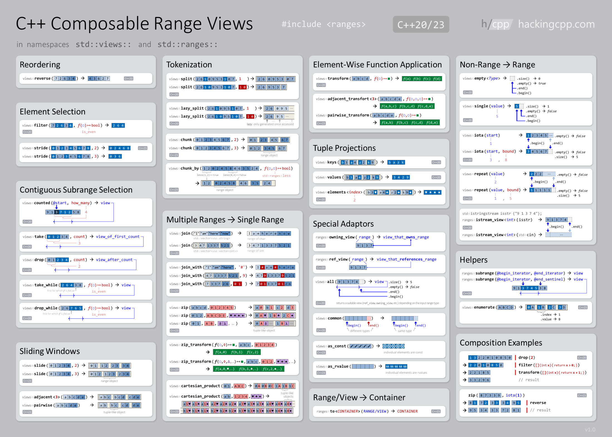

# Ranges and Views

Back to Tutorial [home](../README.md)

Back to the Chapter [Overview](Overview.md)

## Background C and C++

See:
https://www.youtube.com/watch?v=pwb80QJiR-g&list=PLWxziGKTUvQFVSW_xNZEXufvaYuqKeBa1&index=3
https://www.youtube.com/watch?v=W8euWFcwJ_U
https://hackingcpp.com/cpp/std/range_views_intro.html
https://hackingcpp.com/cpp/std/range_views.png

;

## New syntax cppfront

Shows how is done now

## How is the code transpiled

## Advanced topics

Cover other advanced modern C++ topics (e.g. C++ 17, 20, 23) because the idea is to teach how to write code right.
If cppfront does not have a specific syntax, then use modern C++.

## Next

To the [next Chapter](../control_statements/Introduction_Controls.md).

To the [previous Chapter](Tuples.md).

Back to Tutorial [home](../README.md)

Back to the Chapter [Overview](Overview.md)
