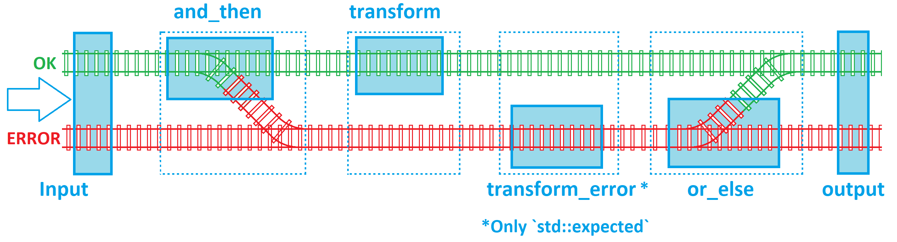
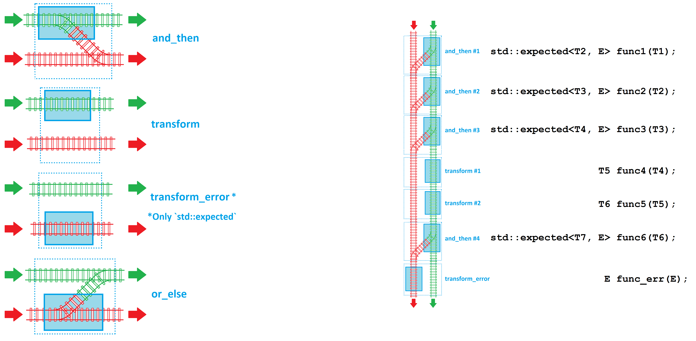

# Functional Programming


Back to Tutorial [home](../README.md)

Back to the Chapter [Overview](Overview.md)


This chapter provides an introduction to Functional Programming in C++ and Cppfront with a focus on [`std::optional`](https://en.cppreference.com/w/cpp/utility/optional)  and [`std::expected`](https://en.cppreference.com/w/cpp/utility/expected). The explanation is inspired by Scott Wlaschin's concept of ["Railway Oriented Programming"](https://www.youtube.com/watch?v=fYo3LN9Vf_M), which is a functional approach for error handling using a railway analogy.

## Background C++

`std::optional<T>` is a template class introduced in C++17 that encapsulates an optional value of type `T`. It provides a safer alternative to raw pointers for representing missing or optional values. The presence of a value must be checked (using `has_value()` or `operator bool()`) before accessing it, reducing the risk of dereferencing invalid pointers.

`std::expected<T, E>` is another template class that is proposed for C++23 standards which encapsulates a value that is either the expected type `T` or an error type `E`. Like `std::optional`, it requires checking for validity before use.

Both `std::optional` and `std::expected` support monadic operations that simplify chaining together sequences of operations:

- `transform()`: Applies a function to the contained value and returns the result wrapped in the same type (`std::optional` or `std::expected`).
- `and_then()`: Applies a function that itself returns an `std::optional` or `std::expected`, useful for chaining operations that might fail.
- `transform_error()`: Specific to `std::expected`, it applies a function to the contained error value, transforming it to another type.
- `or_else()`: For `std::optional`, it provides a default value in case the optional is empty. For `std::expected`, it can transform an error to another type or provide a valid value.

The railway analogy visualizes `std::optional` and `std::expected` as a two-track railway system where one track carries successful values (OK) and the other track carries empty values (in the case of `std::optional`) or errors (in the case of `std::expected`). This system allows us to define clear paths for both successful operations and error handling, ensuring that each function in the sequence contributes to a robust and maintainable process flow.



When processing input with `std::optional` or `std::expected`, we apply a series of operations that may succeed or fail. These operations are neatly organized into a pipeline where the success or failure path is clearly defined, and operations are cleanly separated from error handling logic. This approach simplifies the code by abstracting away explicit control flow and side effects, leading to more readable and maintainable code.

Imagine each operation type as a building block that can be connected to another creating a longer structure as shown below:



Using `std::optional`
```c++
#include <iostream>
#include <optional>
#include <functional>


std::optional<int> safe_divide(int numerator, int denominator) {
    std::cout << "safe_divide\n";
    if (denominator == 0) return std::nullopt; // Error case
    return numerator / denominator; // Success case
}

std::optional<int> add_five(int x) {
    std::cout << "add_five\n";
    return x + 5;
}

int add_two(int x) {
    std::cout << "add_two\n";
    return x + 2;
}

std::optional<int> orelse() {
    std::cout << "orelse\n";
    return 5;
}

int main() {
    // Successful case:
    std::optional<int> result = safe_divide(10, 2)
        .and_then(add_five)
        .and_then(add_five) // Chaining operations successfully
        .transform(add_two) // Chaining operations successfully
        .or_else(orelse); // Chaining operations successfully

    if (result) {
        std::cout << *result << std::endl; // Correct output: 15
    }

    // Error case:
    std::optional<int> error_result = safe_divide(10, 0)
        .and_then(add_five)
        .and_then(add_five) // Chaining halts due to division by zero
        .transform(add_two) // Chaining operations successfully
        .or_else(orelse); // Chaining operations successfully

    if (error_result) {
        std::cout << *error_result << std::endl;
    } else {
        std::cout << "Error: Division by zero." << std::endl; // Error handling
    }

    return 0;
}
```


Using `std::expected`
```c++
#include <iostream>
#include <expected>
#include <functional>

enum class parse_error
{
    f1,
    f2,
    f3
};

std::expected<int, parse_error> safe_divide(int numerator, int denominator) {
    std::cout << ">> safe_divide\n";
    if (denominator == 0) return std::unexpected(parse_error::f1); // Error case
    return numerator / denominator; // Success case
}

std::expected<int, parse_error> add_five(int x) {
    std::cout << ">> add_five\n";
    return x + 5;
}

int add_two(int x) {
    std::cout << ">> add_two\n";
    return x + 2;
}
std::expected<int, parse_error> unexpected([[maybe_unused]] parse_error e) {
    std::cout << " >> unexpected\n";
    return std::unexpected(parse_error::f3);

}

parse_error error([[maybe_unused]] parse_error e) {
    std::cout << " >> error\n";
    return parse_error::f3;

}

int main() {
    // Successful case:
    std::expected<int, parse_error> result = safe_divide(10, 2)
        .and_then(add_five)
        .and_then(add_five) // Chaining operations successfully
        .transform(add_two); // Chaining operations successfully
        //.or_else(orelse); // Chaining operations successfully

    if (result) {
        std::cout << *result << std::endl; // Correct output: 15
    }

    // Error case:
    std::expected<int, parse_error> error_result = safe_divide(10, 0)
        .and_then(add_five)
        .and_then(add_five) // Chaining halts due to division by zero
        .transform(add_two) // Chaining operations successfully
        .or_else(unexpected); // Chaining operations successfully
        //.transform_error(error); // Chaining operations successfully

    if (error_result) {
        std::cout << *error_result << std::endl;
    } else {
        std::cout << "Error: " << *error_result << std::endl; // Error handling
    }

    return 0;
}
```

### Using functions with multiple parameters

Nomadic operations also allows the use of functions with multiple input parameters. This can be done by the use of `std::bind` and `std::placeholders`. Lets get the exampple of a function `my_add(int x, int y)` that adds x and y.

```c++
int my_add(int x, int y) {
    return x + y;
}
...
transform(std::bind(my_add, std::placeholders::_1, 10)) // x receives from the pipe and y receives 10

//or

transform(std::bind(my_add, 10, std::placeholders::_1)) // x receives 10 and y receives from the pipe

```

`std::placeholders` defines which


### Dynamic definition of the Monad sequence

This can be useful to define some sequence of operations at run time, example via a configuration file.
In this case, we add the desired sequence of functions inside a vector and later process all of them in a loop, kind of dynamic decorator.

```c++
#include <iostream>
#include <expected>
#include <functional>
#include <any>
#include <utility>

enum class parse_error{f1, f2,f3};

std::expected<std::any, parse_error> add_five(std::any x) {
    std::cout << ">> add_five\n";
    return std::any_cast<int>(x) + 5;
}

std::expected<std::any, parse_error> to_str(std::any x) {
    std::cout << ">> to_str\n";
    return "My String = "+std::to_string(std::any_cast<int>(x));
}

std::expected<std::any, parse_error> make_error([[maybe_unused]] std::any x) {
    std::cout << " >> unexpected\n";
    return std::unexpected(parse_error::f3);

}

int main() {
    std::expected<std::any, parse_error> res = int{10};
    std::vector<std::function<std::expected<std::any, parse_error>(std::any)>> functions;
    functions.push_back(add_five);
    //functions.push_back(make_error);
    functions.push_back(to_str);

    for(const auto& func: functions){
        std::cout << "-->\n";
        res = res.and_then(func);
    }
    if (res) {
        std::cout << std::any_cast<std::string>(*res) << std::endl; // Correct output
    }else{
        std::cout << "Error: " << std::to_underlying(res.error()) << std::endl; // Error handling
    }
    return 0;
}
```

## New syntax cppfront

Shows how is done now


## How is the code transpiled

## Advanced topics

Cover other advanced modern C++ topics (e.g. C++ 17, 20, 23) because the idea is to teach how to write code right.
If cppfront does not have a specific syntax, then use modern C++.


## Next

To the [next Chapter](../user_defined_types/Overvie_new_syntax_type.md).

To the [previous Chapter](Scope_Lifetime.md).

Back to Tutorial [home](../README.md)

Back to the Chapter [Overview](Overview.md)
