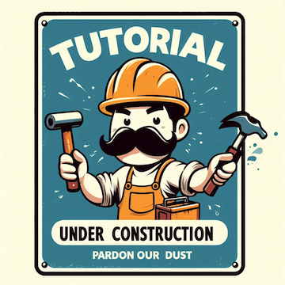

# Memory safety

Back to Tutorial [home](../readme.md)

Back to the Chapter [Overview](Overview.md)

## Background C and C++

How it is done in C and C++ 98 and modern C++

## New syntax cppfront

Shows how is done now

## How is the code transpiled

## Advanced topics

Cover other advanced modern C++ topics (e.g. C++ 17, 20, 23) because the idea is to teach how to write code right.
If cppfront does not have a specific syntax, then use modern C++.

