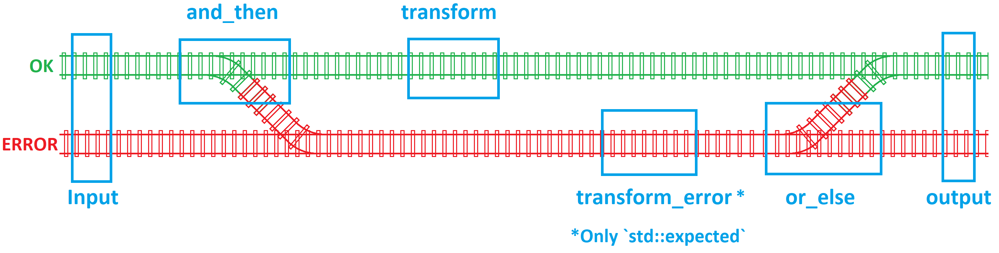

# Functional Programming


Back to Tutorial [home](../readme.md)

Back to the Chapter [Overview](Overview.md)


## Background C and C++

How it is done in C and C++ 98 and modern C++

From: [Scott Wlaschin — Railway oriented programming](https://www.youtube.com/watch?v=fYo3LN9Vf_M), valid for `std::optional` and `std::expected`.




Using `std::optional`
```c++
#include <iostream>
#include <optional>
#include <functional>


std::optional<int> safe_divide(int numerator, int denominator) {
    std::cout << "safe_divide\n";
    if (denominator == 0) return std::nullopt; // Error case
    return numerator / denominator; // Success case
}

std::optional<int> add_five(int x) {
    std::cout << "add_five\n";
    return x + 5;
}

int add_two(int x) {
    std::cout << "add_two\n";
    return x + 2;
}

std::optional<int> orelse() {
    std::cout << "orelse\n";
    return 5;
}

int main() {
    // Successful case:
    std::optional<int> result = safe_divide(10, 2)
        .and_then(add_five)
        .and_then(add_five) // Chaining operations successfully
        .transform(add_two) // Chaining operations successfully
        .or_else(orelse); // Chaining operations successfully

    if (result) {
        std::cout << *result << std::endl; // Correct output: 15
    }

    // Error case:
    std::optional<int> error_result = safe_divide(10, 0)
        .and_then(add_five)
        .and_then(add_five) // Chaining halts due to division by zero
        .transform(add_two) // Chaining operations successfully
        .or_else(orelse); // Chaining operations successfully

    if (error_result) {
        std::cout << *error_result << std::endl;
    } else {
        std::cout << "Error: Division by zero." << std::endl; // Error handling
    }

    return 0;
}
```


Using `std::expected`
```c++
#include <iostream>
#include <expected>
#include <functional>

enum class parse_error
{
    f1,
    f2,
    f3
};

std::expected<int, parse_error> safe_divide(int numerator, int denominator) {
    std::cout << ">> safe_divide\n";
    if (denominator == 0) return std::unexpected(parse_error::f1); // Error case
    return numerator / denominator; // Success case
}

std::expected<int, parse_error> add_five(int x) {
    std::cout << ">> add_five\n";
    return x + 5;
}

int add_two(int x) {
    std::cout << ">> add_two\n";
    return x + 2;
}
std::expected<int, parse_error> unexpected(parse_error e) {
    std::cout << " >> unexpected\n";
    return std::unexpected(parse_error::f3);

}

parse_error error(parse_error e) {
    std::cout << " >> error\n";
    return parse_error::f3;

}

int main() {
    // Successful case:
    std::expected<int, parse_error> result = safe_divide(10, 2)
        .and_then(add_five)
        .and_then(add_five) // Chaining operations successfully
        .transform(add_two); // Chaining operations successfully
        //.or_else(orelse); // Chaining operations successfully

    if (result) {
        std::cout << *result << std::endl; // Correct output: 15
    }

    // Error case:
    std::expected<int, parse_error> error_result = safe_divide(10, 0)
        .and_then(add_five)
        .and_then(add_five) // Chaining halts due to division by zero
        .transform(add_two) // Chaining operations successfully
        .or_else(unexpected); // Chaining operations successfully
        //.transform_error(error); // Chaining operations successfully

    if (error_result) {
        std::cout << *error_result << std::endl;
    } else {
        std::cout << "Error: " << *error_result << std::endl; // Error handling
    }

    return 0;
}
```

## New syntax cppfront

Shows how is done now


## How is the code transpiled

## Advanced topics

Cover other advanced modern C++ topics (e.g. C++ 17, 20, 23) because the idea is to teach how to write code right.
If cppfront does not have a specific syntax, then use modern C++.

